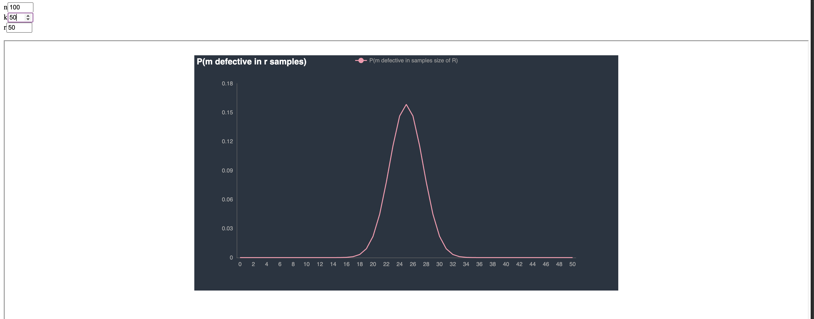

# Quality Control

## Introduction

Given the following scenario:

A factory produces `n` parts in a lot. 
`k` parts in the lot are defective. A sample `r` is taken
from the lot and `m` parts in the sample are found to be defective...

What is the probablity of finding `m` defective parts?
Or in other words, what is `P(m defective in r samples)`?

## About

This is a visualisation tool quickly whipped together to help me understand this particular problem.



It shows the probability distribution of `P(m defective in r samples)`.

This is [based on the following lecture](https://www.youtube.com/watch?v=e7RAK_iQBp0&list=PLMrJAkhIeNNR3sNYvfgiKgcStwuPSts9V&index=6) from Steve Brunton.

## Using it

Prerequisites:
- Go 1.22 or higher

```sh
git clone https://github.com/chrisjpalmer/qualitycontrol
cd qualitycontrol
go run .
```

## How it works

To calculate the large factorial expressions without encountering limits of floating point types, the probability is
evaluated by pairing terms in the numerator and denomenator of the final quotient and dividing them one by one.
The results of each division are then multiplied together. This results in lots of numbers which are between 0 and 1 (mostly)
which yields better results than simply doing things like `1000!`.

Code wise, this is a very rough job... I did not build the most elegant thing in the world but it works. 
The backend is go and the front end is vanilla javascript.

Hope it helps someone else!